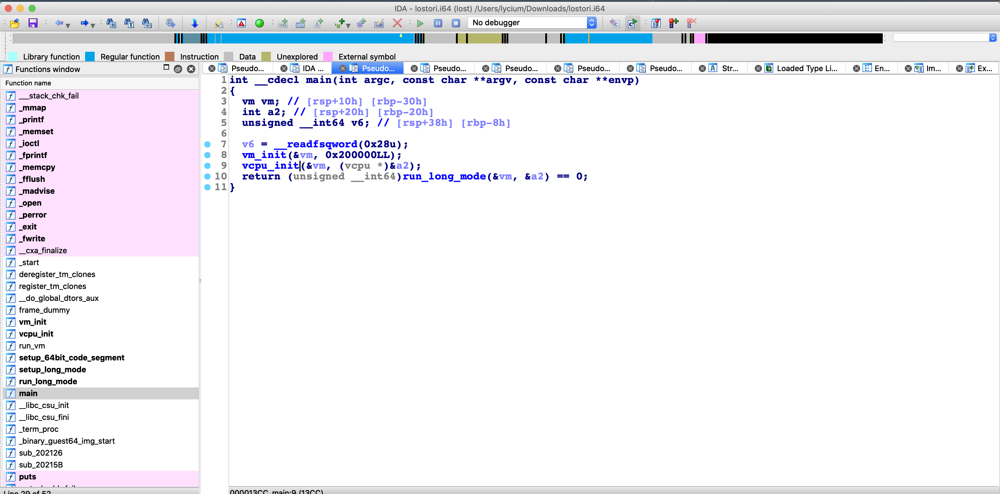
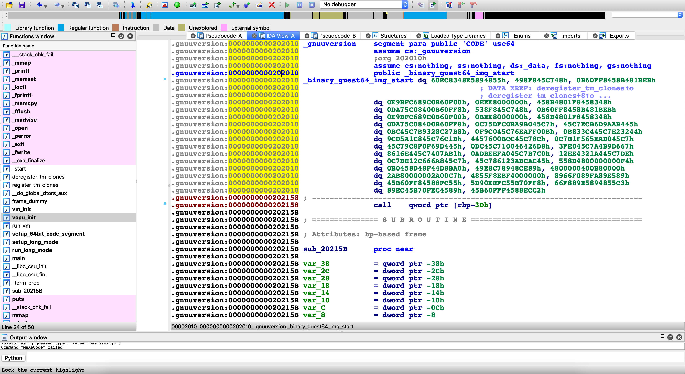
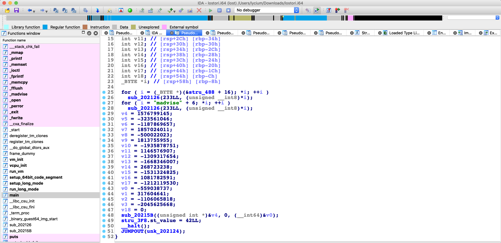
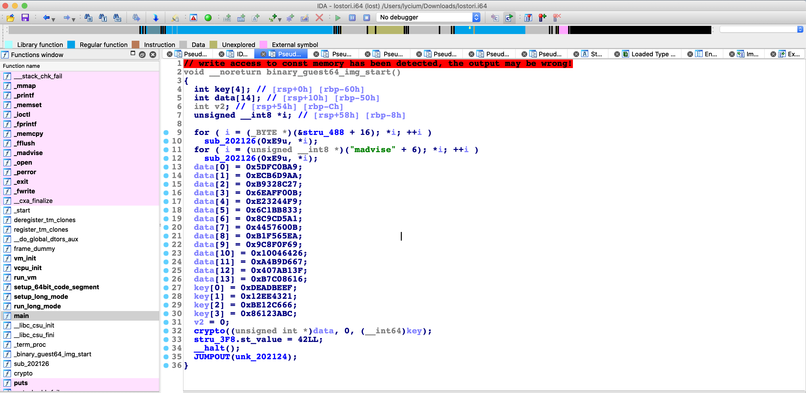

# 失落的圣物

花絮：这是一个十分 mini 的虚拟机，起源很简单，出题人被 XNUCA 的 KVM 伤害过，所以准备出一个虚拟机，一个真的虚拟机而不是 VMP 保护的虚拟机。

KVM 是 Linux 文件抽象化 Kernel-based Virtual Machine 后的文件。KVM 总的来说是虚拟机软件运行的一个比较重要的基石。使得我们操作 Intel VT or AMD-V 来创建和使用虚拟设备更加轻便。

为了赶的上时代潮流，所以全部题目都是 64 bit 的，那我也用 KVM 创建一个 64 位的虚拟机。



那么启动一个虚拟机就三步就可以完成。`vm` 相关属性初始化，虚拟 CPU 相关属性初始化，之后初始化 CPU 使 CPU 在 long mode 下运行。前两个函数都在进行相关初始化的工作。都是约定俗成的调用约定，相关详细细节可以查询 KVM 相关资料即可了解。主要的逻辑在第三个函数 `run_long_mode()`。


我们可以看到虚拟机执行代码段的内容就是 `binary_guest64_img_start`



我们看到了一堆数据一样的东西。我们把鼠标移动到地址为 `0x202010` 的位置按 “C” 键，把这段数据创建成函数。然后按 F5。



看到这里，我想大概率的我们知道这些数据是什么了，这些数据就是 flag 加密后的内容。

改一下类型让 F5 的结果好看一些。



我们来着重分析下 `crypto()` 函数。

如此规整的反编译结果一定是某种加密算法。


这样结构的加密算法是 XXTEA 加密。可以看到当 n > 0 时是加密，n < 0 时是解密算法，n 是 int 长度。

```C
#include <stdio.h>
#include <stdlib.h>
#include <stdint.h>

#define DELTA 0x9e3779b9
#define MX (((z >> 5 ^ y << 2) + (y >> 3 ^ z << 4)) ^ ((sum ^ y) + (key[(p & 3) ^ e] ^ z)))

void btea(uint32_t *v, int n, uint32_t const key[4])
{
  uint32_t y, z, sum;
  unsigned p, rounds, e;
  if (n > 1)
  { /* Coding Part */
    rounds = 6 + 52 / n;
    sum = 0;
    z = v[n - 1];
    do
    {
      sum += DELTA;
      e = (sum >> 2) & 3;
      for (p = 0; p < n - 1; p++)
      {
        y = v[p + 1];
        z = v[p] += MX;
      }
      y = v[0];
      z = v[n - 1] += MX;
    } while (--rounds);
  }
  else if (n < -1)
  { /* Decoding Part */
    n = -n;
    rounds = 6 + 52 / n;
    sum = rounds * DELTA;
    y = v[0];
    do
    {
      e = (sum >> 2) & 3;
      for (p = n - 1; p > 0; p--)
      {
        z = v[p - 1];
        y = v[p] -= MX;
      }
      z = v[n - 1];
      y = v[0] -= MX;
      sum -= DELTA;
    } while (--rounds);
  }
}

uint32_t cipher[4];

int main()
{
  uint32_t v0[18]={0};
    v0[4] = 0x5DFC0BA9;
  v0[5] = 0xECB6D9AA;
  v0[6] = 0xB9328C27;
  v0[7] = 0x6EAFF00B;
  v0[8] = 0xE23244F9;
  v0[9] = 0x6C1BB833;
  v0[10] = 0x8C9CD5A1;
  v0[11] = 0x4457600B;
  v0[12] = 0xB1F565EA;
  v0[13] = 0x9C8F0F69;
  v0[14] = 0x10046426;
  v0[15] = 0xA4B9D667;
  v0[16] = 0x407AB13F;
  v0[17] = 0xB7C08616;
  v0[0] = 0xDEADBEEF;
  v0[1] = 0x12EE4321;
  v0[2] = 0xBE12C666;
  v0[3] = 0x86123ABC;
  
  btea(&v0[4], -14, v0);
  printf("%s", &v0[4]);
  return 0;
}

```

bingo！
