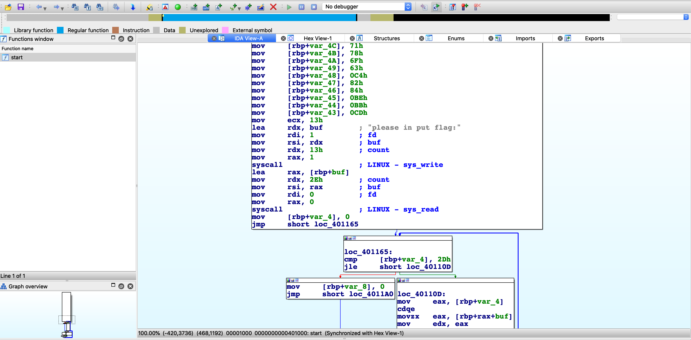

# 小巧玲珑的 ELF

花絮：出题人想了很久，逆向怎么好玩，还要让萌新友好呢？在此过程中一位同学喜欢开源套件的工具 `objdump`，那就出一个逆向很友好的题目吧，有反汇编引擎做起来会十分的舒服。这个同学参加玩比赛之后就抛弃了 `objdump`，2333333。笑死

新手友好！新手友好！

那么当然不要搞那么多花里胡哨的东西咯，所以我出题的时候就没有使用任何库函数，只使用了 `syscall`，使用一些技巧处理编译后就剩下了一个孤零零的 `start` 函数。

一般而言，ELF 的入口函数是 `start` 函数。



在动员大会上我介绍了 IDA 的牛逼功能 F5，按一下玩一年。


可以看到 `v0`-`v45` 总共 46 个 char 型变量。我们先创建一个 46 字节的数组。


逻辑很清晰了，读取一个字符串到 `input` 数组里。然后对该数组的每一个先加 2i，再与 i 异或，再减去 i。

然后和 `aim` 数组中的数值比较。写一个 Python 逆运算脚本即可。

```python
#!/usr/bin/env python3
aim = [102,110,101,107,131,78,109,116,133,122,111,87,145,115,144,79,141,127,99,54,108,110,135,105,163,111,88,115,102,86,147,159,105,112,56,118,113,120,111,99,196,130,132,190,187,205]
for i in range(len(aim)):
    one = aim[i]
    one = (one + i) % 256
    one = one ^ i
    one = (one - 2 * i) % 256
    print(chr(one), end="")
```
