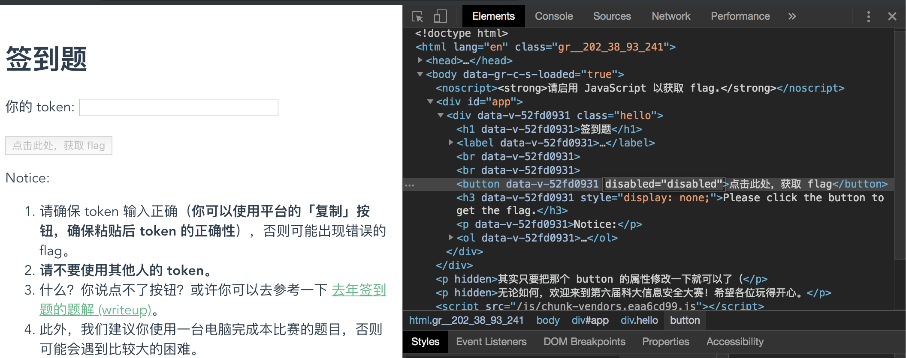

# 签到题

这道题继承了[去年的签到题](https://github.com/ustclug/hackergame2018-writeups/tree/master/official/qiandao)，同样也需要在浏览器中动点手脚。当然，今年我在题目中增加了萌新友好的提示，于是终于没有人问是不是题目/键盘/浏览器/鼠标坏了。

## 简单的解法

以 Chrome 浏览器为例，粘贴 token 之后，在空白处右键点击「检查」（或者按下 F12 / Command + Option + I (macOS)），找到对应的按钮，把 `disabled="disabled"` 去掉就可以了。



## 复杂的解法

如果你就是不想改网页 DOM，或者因为条件限制无法使用浏览器的开发者工具，也有更复杂的解法。

首先可以注意到，`/js/app.ddc36899.js` 包含了网页的主要逻辑。格式化后在里面翻一遍就可以看到一个奇怪的变量 `B64Flag`，值为 `ZmxhZ3tXZWxjb21lX3RvX0hhY2tlcmdhbWVfMjAxOQ==`，base64 解码之后就是 `flag{Welcome_to_Hackergame_2019`。

这还不是完整的 flag。再往上翻一点，可以看到一个 `showFlag()` 的 method:

```javascript
showFlag: function() {
	this.token ? (this.realFlag = atob(this.happyFlag),
	this.processedToken = u.a.SHA1(this.token).toString(u.a.enc.Hex).substring(0, 10),
	this.realFlag = this.realFlag.substring(0, this.realFlag.length) + "_" + this.processedToken + "}",
	this.isFlagVisible = !0) : (this.realFlag = "请输入 token。",
	this.isFlagVisible = !0)
}
```

处理的逻辑就很清楚了：把上面 base64 解码出的部分 flag 后面加上 `_`，再加上 token 的 SHA1 哈希结果前十位，最后来个 `}` 收尾即可。
